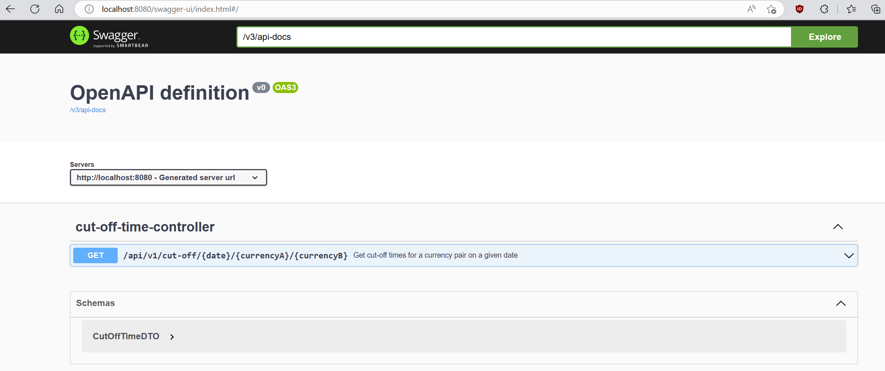
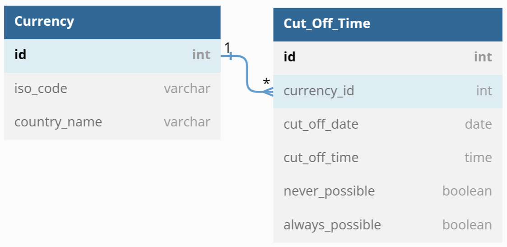
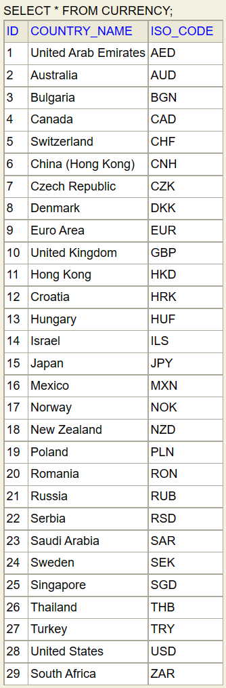
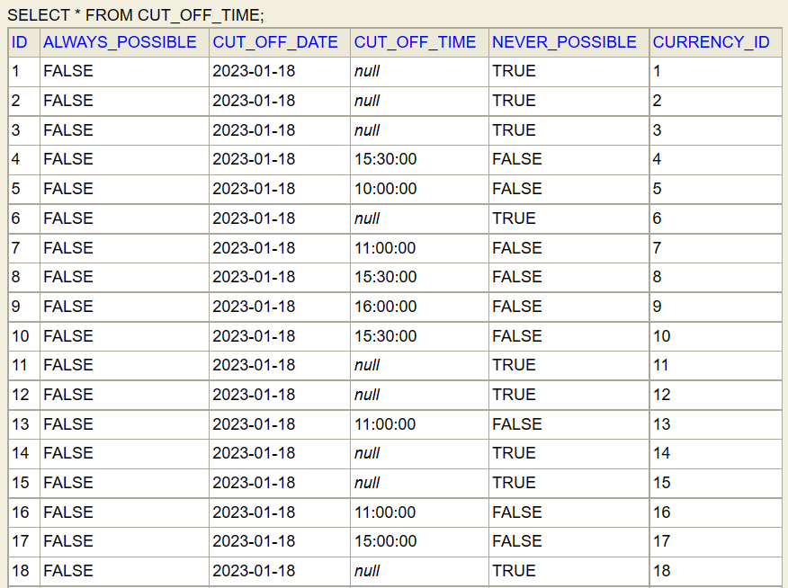

# Cut-Off Service
Service that returns cut-off times for currency pairs on a given date.

Technical coding task

Create a RESTful service that can return cut-off times for currency pairs on a given date.

Example:
- CZK cannot be traded later than 11.00 today, and
- EUR cannot be traded later than 16.00 today, therefore, the cut-off time for today for the currency pair EUR/CZK is 11.00.

Acceptance criteria:
- The service should have a database where cut-off times are stored.
- Support the currencies and cut-off times provided in the table below.
- Expose an endpoint that returns the cut-off time for a currency pair on a particular date; the cut-off time for a currency pair is the earlier deadline.
- Implement the service in Java using Spring Boot.
- API must be documented.

[cut-off-times.xlsx](https://github.com/Justin-Hernandez/cut-off-service/files/10438792/cut-off-times.xlsx)

# Solution

Access API documentation available at http://localhost:8080/swagger-ui.html when the application is launched.

Database diagram:

The data is loaded to a h2 in-memory database every time the service is started with `src/resources/data.sql`.
The cut-off times for *today* in the `cut_off_date` column are generated using the `curdate()` function, and `curdate() + INTERVAL '1' DAY` for *tomorrow*.

